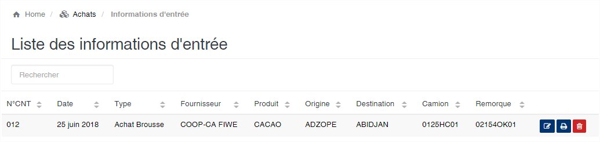
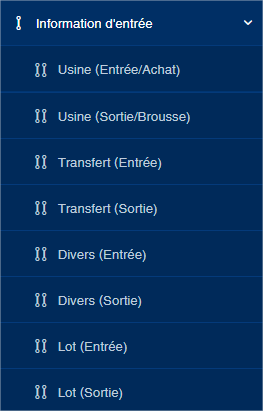

Information d'entrée
====================

La section « **information d’entrée** » est la première étape du processus de gestion de la réception des camions aux ponts Bascules. 
Cette fonction vous permet de saisir les informations sur le produit à recevoir ou à expédier.
SIGAM vous permet de gérer les types de mouvements suivants :

	* **Usine (Entrée/Achat)** : permet de gérer les réceptions de produits achetés non usinés (ex. produit brousse).
	* **Usine (Sortie/Brousse)** : permet de gérer les opérations de sorties de produits non usinés (ex. produits brousse).
	* **Transfert (entrée)** : permet de gérer les réceptions de produits transférés d'un autre site ou usine géré par SIGAM.
	* **Transfert (sortie)** : permet de gérer les produits à transférés vers un autre site ou usine géré par SIGAM.
	* **Divers (entrée)** : permet de gérer les entrées de produit divers (ex. DDO, etc.). Cela n'a aucune influence sur le stock.
	* **Divers (sortie)** : permet de gérer les sorties de produit dives. Cela n'influe pas sur les stocks.
	* **Lot (Entrée)** : permet de gérer les entrées de lots aux ponts bascules.
	* **Lot (Sortie)** : permet de gérer les sorties de lots aux ponts bascules.

En cliquant sur « **Information d’entrée** » vous avez la liste des connaissements créés et qui peuvent faire l’objet d’une modification.

En face de chaque document (ligne) les boutons à droite, vous permettent de **modifier**, **éditer** ou **supprimer** le document.

	
   
.. attention:: Un connaissement ne peut plus être supprimé à partir du moment il a fait l’objet de la 1ère pesée. Les informations des connaissements peuvent être modifiées tant que la dernière pesée n’est pas terminée.

**Création d'un connaissement**
~~~~~~~~~~~~~~~~~~~~~~~~~~~~~~~~

Pour créer un nouveau document, vous devez cliquez sur un des liens (en fonction de votre besoin) en dessous de l'option « **information d’entrée** »

.. toctree::
	:maxdepth: 1
	:titlesonly:
	
	entreeAchat
	sortieBrousse
	entreeTransfert
	sortieTransfert
	entreeDivers
	sortieDivers
	entreeLot
	sortieLot
	