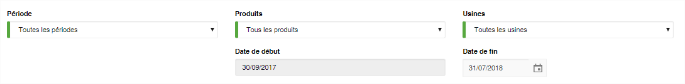
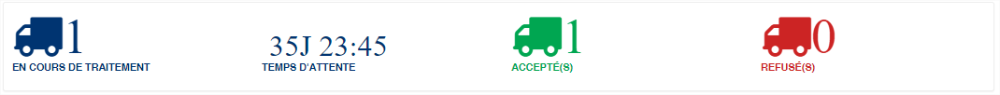
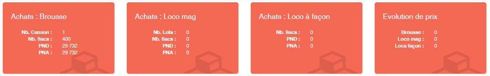
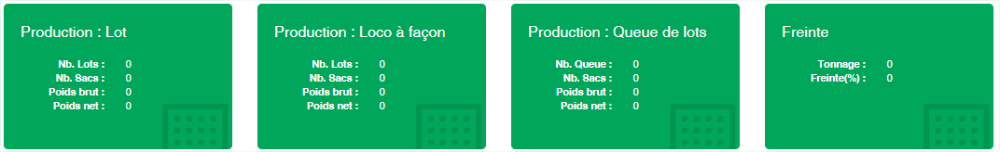
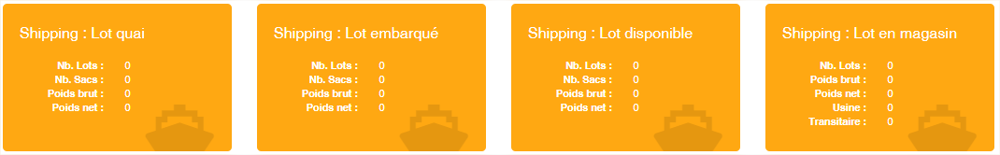
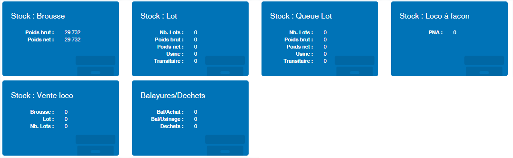
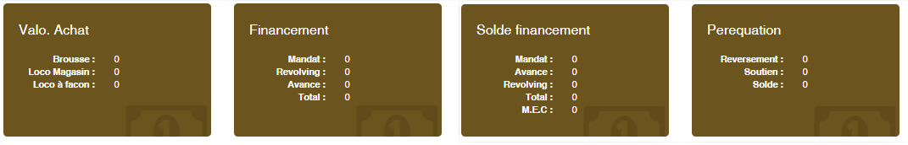

Tableau de bord
===============

.. toctree::
	:maxdepth: 2
	:titlesonly:

Le tableau de bord vous offre une vue synthétique des activités des opérations de votre entreprises. Ils se présente en trois grandes parties
   
**Les filtres**
---------------

La zone de filtres permet de définir la sélection des données à afficher sur le tableau de bord. Toute les zones du filtre appliquent une sélection inclusive.

	* **Période** : Vous pouvez filtrer sur une période de la campagne.
	* **Produits** : Vous pouvez filtrer sur un produit spécifique ou tous les produits
	* **Usines** : Vous pouvez filter sur une usine spécifique ou toutes les usines
	* **Date de début** : Cette date ne peut être modifié. Elle correspond par défaut à la date début de la campagne.
	* **Date de fin** : Vous pouvez indiquer la date de fin des données à afficher dans le tableau de bord. Par défaut c'est la date du jour qui est indiquée.

	
	
**Les camions déchargés**
-------------------------

Cette zone vous permet d'avoir en temps réel les camions déchargés. Elle se divise en quatre zones.

	* Les camions en cours de déchargement sur vos plateformes
	* Le temps moyens de traitement d'un camion
	* Le nombre de camions acceptés depuis le début de la campagne
	* Le nombre de camions rejetés depuis le début de la campagne

**Les vignettes de synthèse**
-----------------------------

Les vignettes de synthèse présente les données importante en fonction des différents secteurs opérationnels

**Les données sur les achats**
	

**Les données sur la production**
	

	
**Les données sur le shipping**
	

	
**Les données sur le stock**
	

**Les données sur les finances**
	

	
	