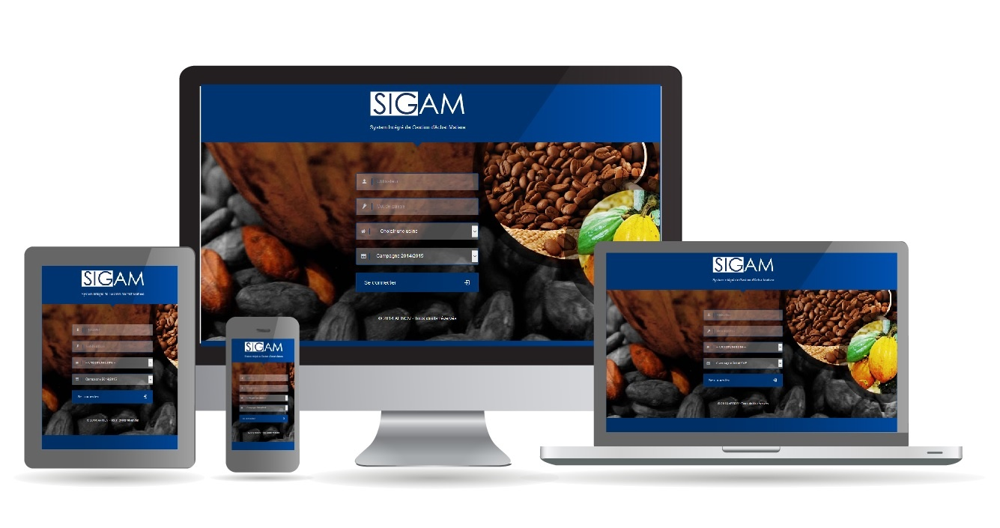

.. SIGAM documentation master file, created by
   sphinx-quickstart on Wed Apr 24 01:56:11 2019.
   You can adapt this file completely to your liking, but it should at least
   contain the root `toctree` directive.

SIGAM (Système Intégré de Gestion des Achats Matières)
======================================================

SIGAM est un logiciel de gestion des achats de produits agricoles en général et du café et cacao en particulier.
SIGAM a été réalisé dans la vision de mettre à votre disposition un logiciel ergonomique et simple à prendre en main.
En dehors des ordinateurs liés à un pont bascule, SIGAM ne nécessite aucune installation sur les postes des utilisateurs. Seul un navigateur internet est nécessaire.
SIGAM dispose d’une interface utilisateur Responsive Design, lui permettant de s’adapter à tous vos périphériques (ordinateur, tablette et smartphone).

Table des matières:

.. toctree:: :maxdepth: 2

 propriete
 installation
 connexion
 generalite
 dashboard
 referentiels/index
 achats/index
 changelog/index

