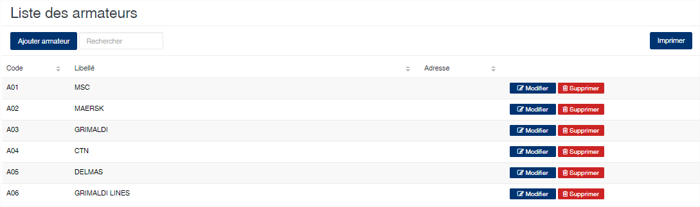
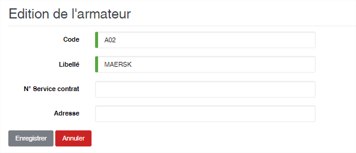

Armateur
=========

.. toctree::
	:maxdepth: 1
	:titlesonly:

Cette option vous permet de gérer les armateurs.

	
   
**Edition de la fiche : Armateur**
~~~~~~~~~~~~~~~~~~~~~~~~~~~~~~~~~~

Toutes les zones de cet écran sont obligatoire.

	* **Code** : indiquez le code de l'armateur
	* **Libellé** : indiquez le libellé de l'armateur
	* **N° service contrat** : indiquez le contrat de service de l'armateur
	* **Adresse** : indiquez l'adresse de l'armateur

