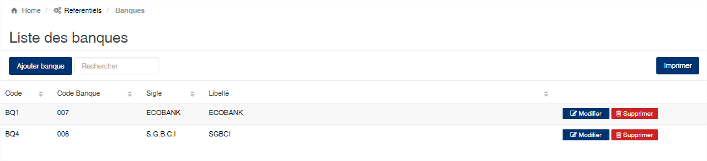
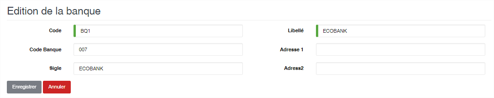

Banque
=======

.. toctree::
	:maxdepth: 1
	:titlesonly:

Cette option permet d’enregistrer les banques.

	
   
**Edition de la fiche : Banque**

	* **Code** : Indiquez le code de la banque. Ce code est unique dans l’application.
	* **Libellé** : Indiquez la désignation de la banque.
	* **Code Banque** : Indiquez le code banque officiel.
	* **Sigle** : Indiquez le sigle de la banque.
	* **Adresse 1 et 2** : Indiquez l’adresse de la banque.

