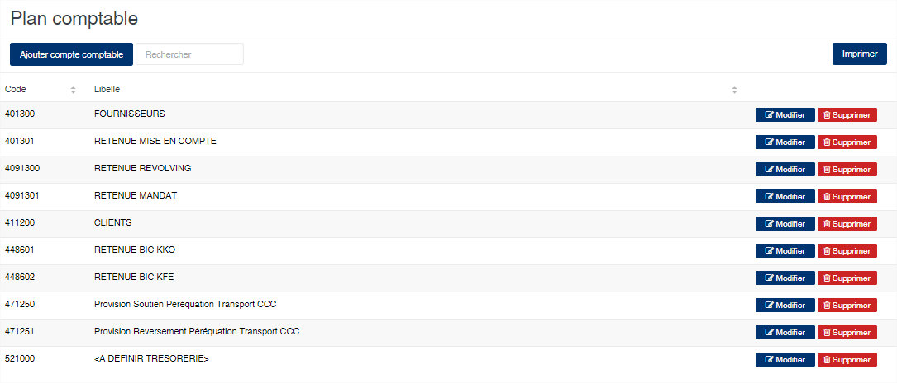
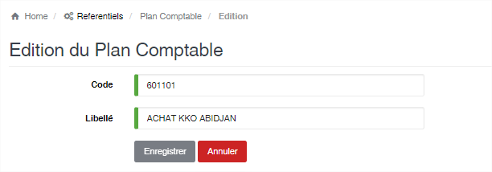

Plan comptable
==============

.. toctree::
	:maxdepth: 1
	:titlesonly:

Cette option permet de saisir les différents comptes comptables utilisés pour la comptabilisation à partir du programme.

	
   
**Edition de la fiche : Plan comptable**

Toutes les zones de cette fiche doivent obligatoirement être remplies.

	* **Code** : Indiquez le numéro de compte comptable.
	* **Libellé** : Indiquez la désignation du compte.

