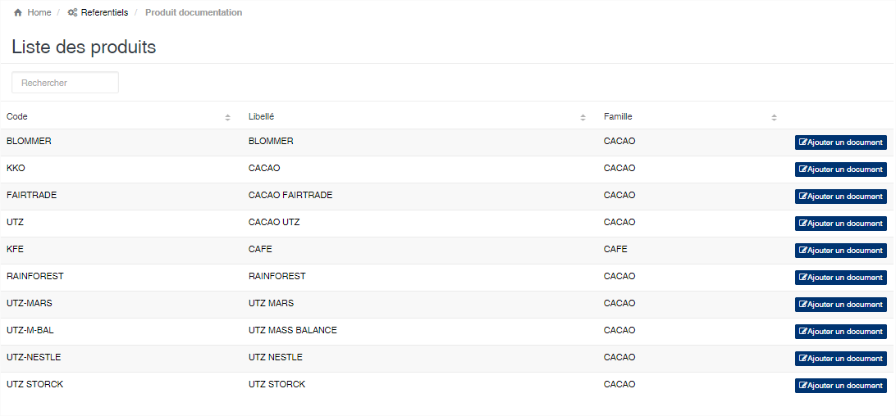
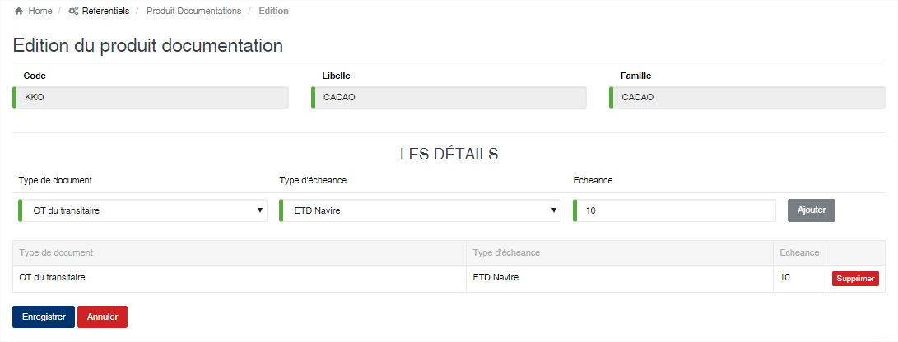

Document / Produit
==================

.. toctree::
	:maxdepth: 1
	:titlesonly:

Cette option permet de définir les documents constituants le dossier d'export d'un produit, ainsi que les échéances associées.
La liste vous affiche automatiquement les produits enregistrés dans l'application. Pour associer un document à une produit veuillez cliquer sur le bouton à droite « **Ajouter un document** »

	
   
**Edition de la fiche : Documentation produit**

Veuillez indiquer le type de document, le type d'échéance et la valeur de l'échéance d'un document, puis appuyer sur le bouton « **Ajouter** » afin de l'ajouter dans la liste.

