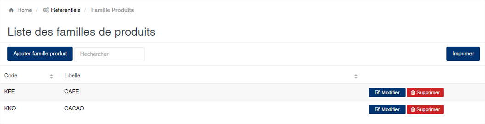
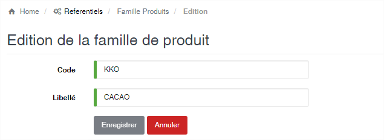

Famille de produit
==================

.. toctree::
	:maxdepth: 1
	:titlesonly:

Cette option vous permet d’enregistrer les différentes familles des produits gérées par l’application

	
   
**Edition de la fiche : Famille de produit**

Toutes les zones de cette fiche sont à remplir obligatoirement.

	* **Code** : Code de la famille de produit.
	* **Libellé** : indiquez la désignation de la famille de produit.

