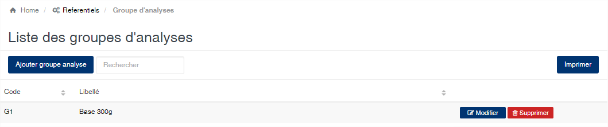
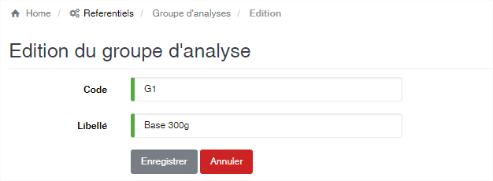

Groupe d'analyse
================

.. toctree::
	:maxdepth: 1
	:titlesonly:

Cette option vous permet d’enregistrer les différents critères de détermination de l’analyse qualité des produits.

	
   
**Edition de la fiche : Groupe d'analyse**

Toutes les zones sont obligatoires.

	* **Code** : indiquez le code du groupe d'analyse. Le code doit être unique.
	* **Libellé** : indiquez la désignation du groupe d'analyse.

