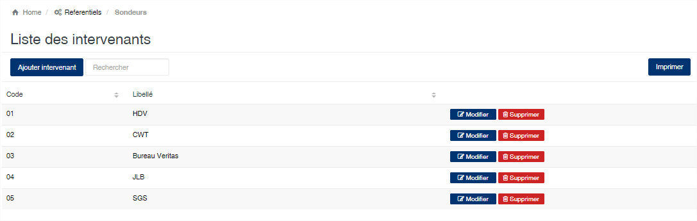
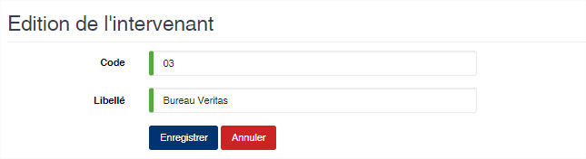

Intervenant
============

.. toctree::
	:maxdepth: 1
	:titlesonly:

Cette option vous permet de gérer les concessionnaires intervenants dans les dossiers exports (Sondeurs, Contrôle qualité, etc.).

	
   
**Edition de la fiche : Intervenant**

Toutes les zones de cette fiche doivent être saisies obligatoirement.

	* **Code** : indiquez le code de l'intervenant
	* **Libellé** : indiquez la désignation de l'intervenant

