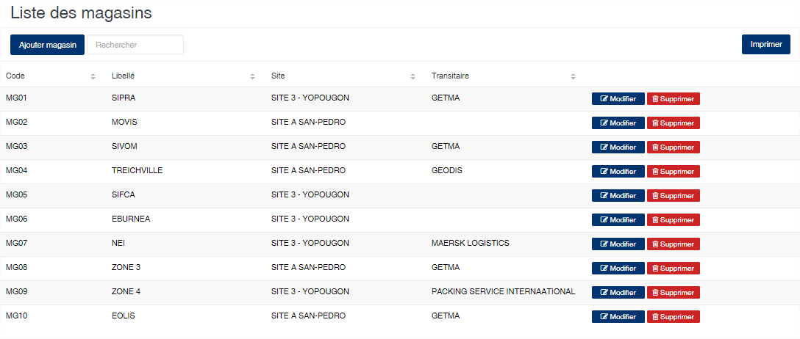
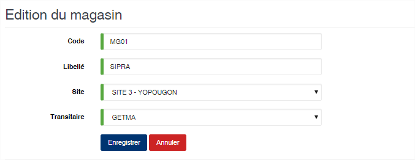

Magasin
=======

.. toctree::
	:maxdepth: 1
	:titlesonly:

Cette option permet d'enregistrer les magasins de stockage des produits.

	
   
**Edition de la fiche : Magasin**

	* **Code** : indiquez le code du magasin
	* **Libellé** : indiquez la désignation du magasin
	* **Site** : sélectionnez le site associé au magasin.
	* **Transitaire** : sélectionnez le transitaire propriétaire du magasin. Cette option est facultative.

.. attention:: La notion de transitaire est importante car elle permet au logiciel les magasins liés à l'usine ou ceux se trouvant à l'extérieur. En effet, par exemple il sera impossible de faire sortir un lot par le pont bascule si son dernier emplacement est un magasin lié à un transitaire.