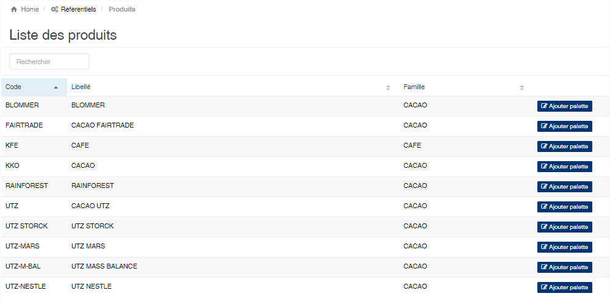
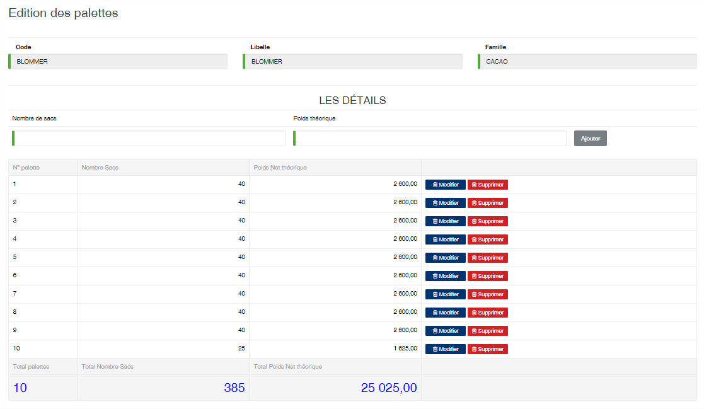

Palettes / Lot
===============

.. toctree::
	:maxdepth: 1
	:titlesonly:

Cette option permet de définir la structure des lots de produit.
La liste affiche automatiquement la liste des produits enregistrés dans l'application. 
Pour définir la structure, vous devez cliquer sur le bouton à droite du produit « **Ajouter palette** »

	
   
**Edition de la fiche : Palette**

Indiquez le nombre de sacs et le poids théorique de chaque palette puis cliquez sur le bouton « Ajouter »

En bas de page, vous avez l'indication du nombre de palette, du nombre de sacs et du poids net d'un lot du produit.
