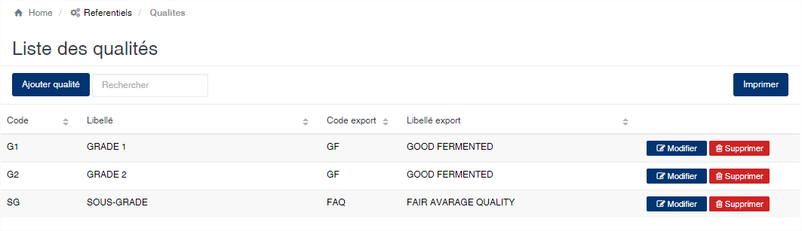
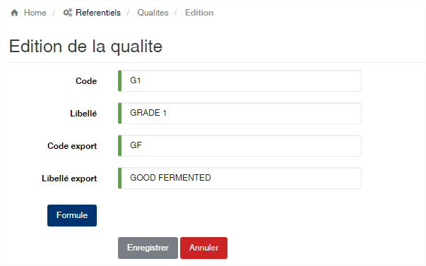
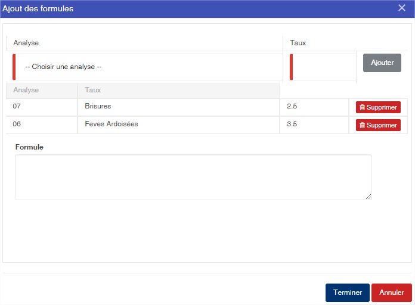

Qualité
=======

.. toctree::
	:maxdepth: 1
	:titlesonly:

Cette option vous permet d’enregistrer les types de qualité de produits.

	
   
**Edition de la fiche : Qualité**

Cette écran vous permet de saisir les informations sur la qualité.

	* **Code** : indiquez le code de la qualité. Cet code est obligatoire et doit être unique dans l'application.
	* **Libellé** : indiquer le libellé de la qualité. cette zone est obligaoire.
	* **Code export** : indiquez le code  de la qualité au niveau du module usinage et shipping. Cette zone est facultative.
	* **Libellé export** : indiquez le libellé de qualité à afficher au niveau du module usinage et shipping.

	
Le bouton **<Formule>** vous permet d'afficher l'écran de saisie des formules de détermination de la qualité

