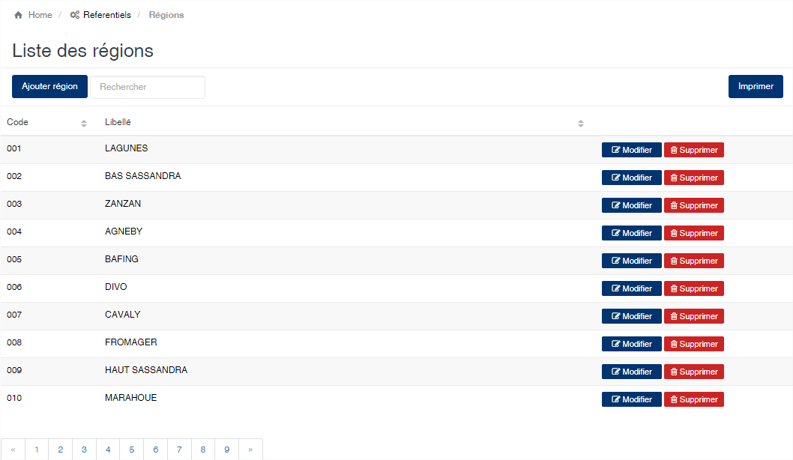
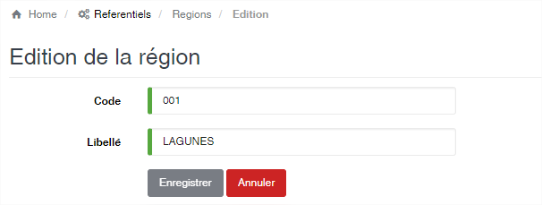

Régions
=======

.. toctree::
	:maxdepth: 1
	:titlesonly:

Cette option vous permet d’enregistrer les régions d’origine des produits.

	
   
**Edition de la fiche : Région**

Toutes les zones de fiche sont obligatoires.

	* **Code** : Indiquez le code de la région. Ce code est unique dans l’application.
	* **Libellé** : Indiquez la désignation de la région.

