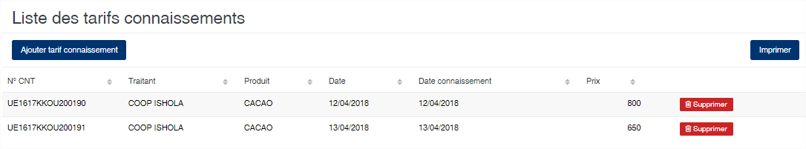
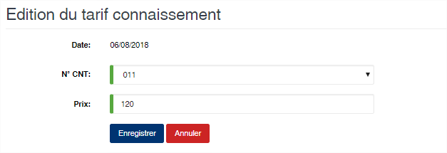

Tarif connaissement
===================

.. toctree::
	:maxdepth: 1
	:titlesonly:

Cette option vous permet de définir un prix d’achat pour un connaissement/déchargement donné.

	
   
**Edition de la fiche : Tarif connaissement**

Toutes les zones sont obligatoires sur cette fiche.

	* **N° CNT** : Sélectionnez le connaissement.
	* **Prix** : Indiquez le prix voulu pour ce connaissement.

