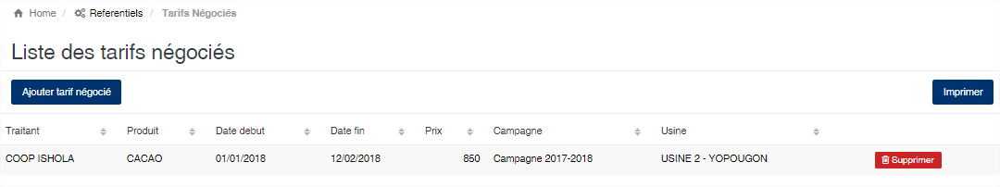
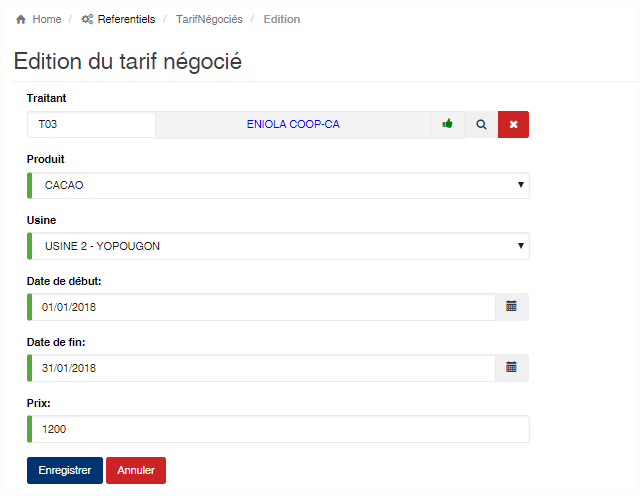

Tarif négocié
=============

.. toctree::
	:maxdepth: 1
	:titlesonly:

Cette option vous permet de définir le prix d’achat négocié pour un fournisseur et pour une période donnée.
Durant toute la période définie le prix indiqué sera automatiquement appliqué aux achats effectués avec ce fournisseur.

	
   
**Edition de la fiche : Tarif négocié**

Toutes les zones sont obligatoires sur cette fiche.

	* **Traitant** : Sélectionnez le traitant.
	* **Produit** : Sélectionnez le produit.
	* **Usine** : Sélectionnez l’usine où les achats seront effectués.
	* **Date de début et date de fin** : Indiquez la période de validité du prix.
	* **Prix** : Indiquez le prix d’achat pour la période et pour le fournisseur.

	
.. note:: L’ordre d’évaluation pour la valorisation des achats est le suivant : **Prix Connaissement => Prix Négocié => Prix Produit**. En effet pour un connaissement donné le programme vérifie qu’il existe un « **prix connaissement** », s’il n’en existe pas il cherche un « **prix négocié** » pour le fournisseur associé au connaissement, s’il n’en existe pas il prend la valeur du « **prix produit** ».

