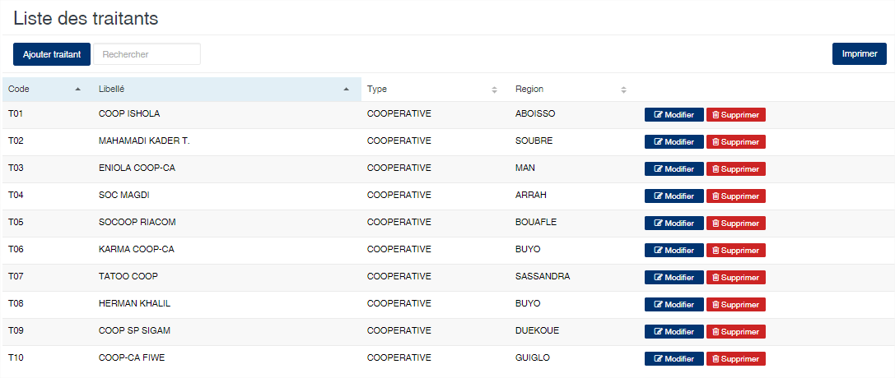
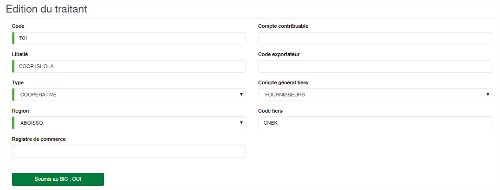
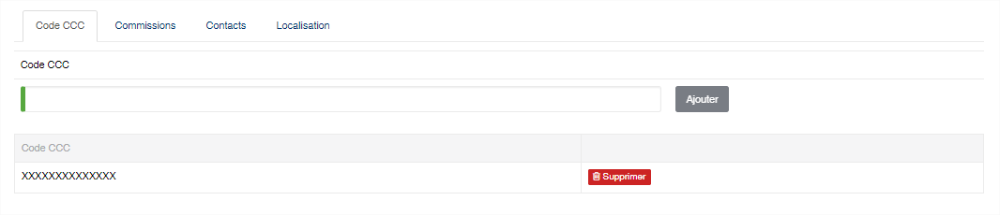
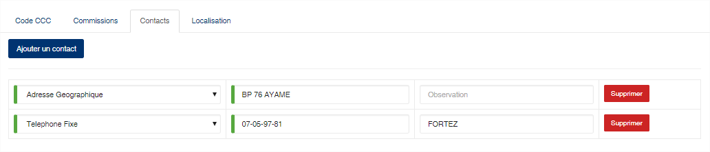
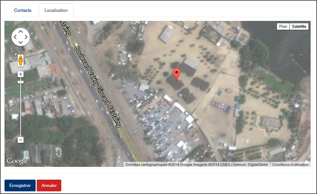

Traitant
===============

.. toctree::
	:maxdepth: 1
	:titlesonly:

Cette option permet d’enregistrer les fournisseurs de produits.

	
   
**Edition de la fiche : Traitant**

Cette fiche se divise en deux parties.
La première partie présente les informations signalétiques du fournisseur et dans la deuxième partie une série d'onglets permettant de définir d'autres informations.

	* **Code** : Indiquez le code du traitant.
	* **Libellé** : Indiquez un libellé du traitant.
	* **Type** : Sélectionnez le type de traitant.
	* **Région** : Sélectionnez la région.
	* **Registre de commerce** : Indiquez le numéro du registre de commerce.
	* **Compte contribuable** : Indiquez le numéro de compte contribuable du fournisseur.
	* **Code exportateur** : Indiquez le code exportateur s’il y a lieu du fournisseur.
	* **Compte général tiers** : Sélectionnez le compte général tiers associé au fournisseur.
	* **Code tiers** : Indiquez le compte auxiliaire du fournisseur.
	* **Soumis au BIC** : Activé, indique que le fournisseur fera l’objet du prélèvement de la retenue BIC lors du règlement de ses livraisons.

-----------------

**Onglet : CCC**
-----------------

Vous pouvez ici enregistrer les références d'immatriculation auprès de l'autorité de régulation.

	

------------------------

**Onglet : Commission**
------------------------
	
Cet onglet vous permet de définir les règles de calcul des commissions des fournisseurs en fonction de leur livraison.

	* **Poids** : indiquez le poids à partir duquel la commission sera calculée
	* **Commission 1, 2 et 3** : indiquez le prix au kilo à appliquer sur les livraisons afin d'avoir le montant des commissions à versées.

.. image:: ../_img/referentiels/traitant4.png
	:alt: édition
	:align: center
	:height: 278
	:width: 800
	
------------------------

**Onglet : Contact**
------------------------
	
Cet onglet vous permet de définir les différents contacts du fournisseur.
	

	
	
--------------------------

**Onglet : Localisation**
--------------------------
	
Cet onglet vous permet d'indiquez la localisation du siège du fournisseur sur une carte géographique.
	

	
.. note:: La géolocalisation se base sur des cartes Google Maps. L’affichage des cartes nécessite que vous ayez un accès internet sur votre poste travail.
	
	
