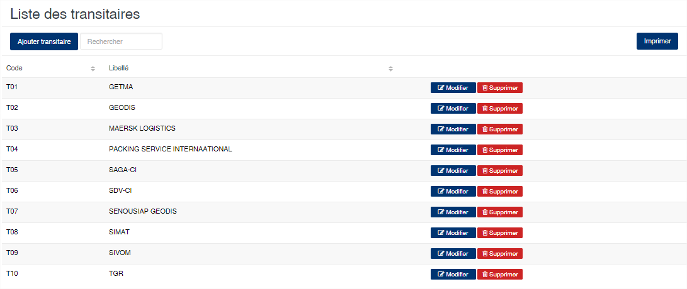
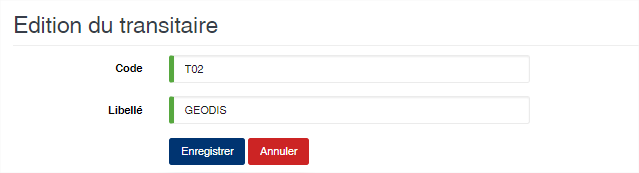

Transitaire
============

.. toctree::
	:maxdepth: 1
	:titlesonly:

Cette option permet de gérer la liste des transitaires.

	
   
**Edition de la fiche : Transitaire**

Toutes les zones de cette fiche doivent obligatoirement être renseignées.

	* **Code** : indiquez le code du transitaire.
	* **Libellé** : indiquez la raison sociale du transitaire.

