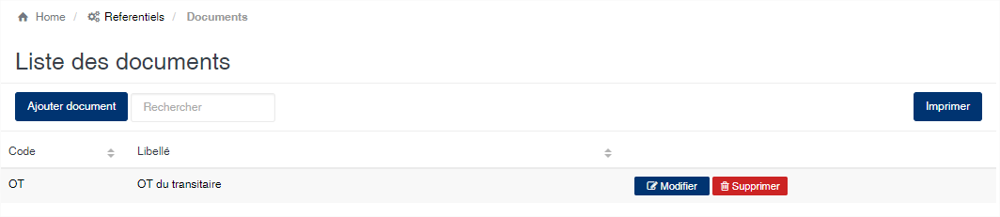
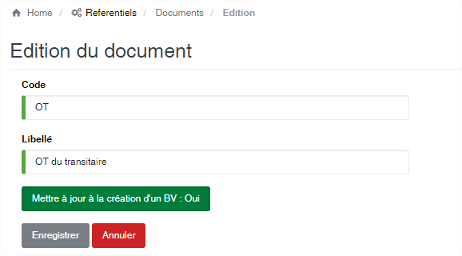

Type de documents
=================

.. toctree::
	:maxdepth: 1
	:titlesonly:

Cette option permets de gérer la liste des documents constituants les dossiers d'exportation de produits.

	
   
**Edition de la fiche : Trémie**

Toutes les zones de cette fiche sont à remplir obligatoirement.

	* **Code** : indiquez le code du document. 
	* **Libellé** : indiquer la désignation du document.

