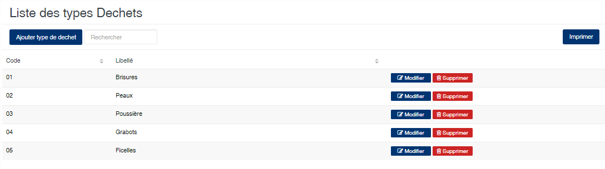
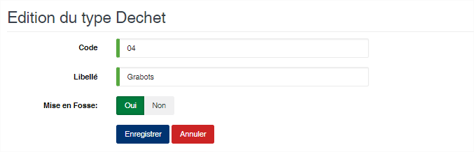

Type sous-produit
=================

.. toctree::
	:maxdepth: 1
	:titlesonly:

Cette option vous permet de gérer la liste des sous-produits issus de l'usinage des produits.

	
   
**Edition de la fiche : Type de sous-produit**

	* **Code** : indiquez le code du sous-produit
	* **Libellé** : indiquez la désignation du sous-produit
	* **Mise en fosse (oui/non)** : activé, cette option indique que le sous produit peut être remis en fosse afin de constituer un lot. Dans ce cas il est pris en compte dans le calcul de la freinte d'usinage.

