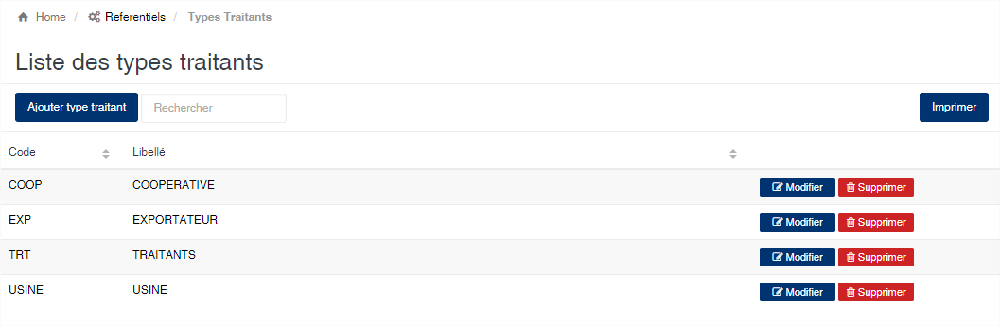
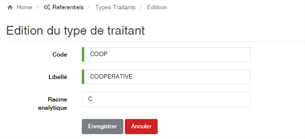

Type traitant
=============

.. toctree::
	:maxdepth: 1
	:titlesonly:

Cette option permet d’enregistrer les différentes catégories de fournisseurs.

	
   
**Edition de la fiche : Type de traitant**

Le code et la désignation sont obligatoire.

	* **Code** : Indiquez le code du type de traitant.
	* **Libellé** : Indiquez la désignation du type de traitant.
	* **Racine analytique** : Indiquez la racine qui sera utilisée lors de la comptabilisation. L’usage de cette zone lors de la comptabilisation dépendra de votre schéma de comptabilisation des écritures d’achats.

